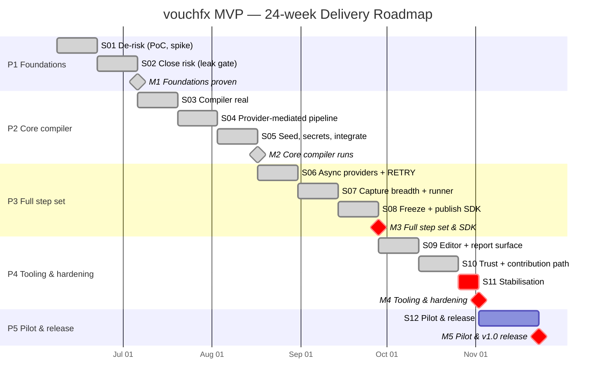

# vouchfx MVP — Delivery Roadmap (Gantt)

A sprint- and milestone-level view of the [delivery plan](README.md). Rendered natively by GitHub via
[Mermaid](https://docs.github.com/en/get-started/writing-on-github/working-with-advanced-formatting/creating-diagrams)
— no external tooling, and it stays in version control alongside the plan.

> Dates are **notional**, anchored to a Monday start (2026-06-08) purely to lay the bars out. Per
> MVP §7.2 the calendar sizes the effort; **milestones, not dates, are the measure of progress**.
> Sprint 11 is a 1-week stabilisation sprint; Sprint 12 is a 3-week pilot/release sprint.
>
> **Progress (2026-07-04):** Sprints **01–11 delivered and merged to `main`**. **M1 (closed S02), M2 (closed S05), M3 (closed S08), and M4 (closed S11) are all delivered.** M3 is engineering-complete with all eighteen Core providers across eight families, v1 schema/contract/event-wire frozen, Provider SDK published and outside-validated, runner selection/parallelism/Vault, polling timeline and captured-variable rendering — exit-gated on three human items (steering review, GitLab live run #153, certificate provisioning; see `plan/m3-phase-exit.md`). M4 is engineering-complete with VSCode + CLI features, HTML/JUnit/--events reporting, CI templates, four-technology reference scenario green, memory-leak CI gate, secret-redaction penetration-tested, signed release — exit-gated on three human items (steering review, GitLab live run, certificate provisioning; see `plan/m4-phase-exit.md`). **M5 (Pilot & v1.0, Sprint 12) is in progress:** community provider hub (`vouchfx-providers`) live with Verified/Community tiers (PR #157, docs merged), `vouchfx-samples` repository published (real C#/Python/Java sample apps + suites), telemetry backend (`vouchfx-telemetry-backend`) implemented and deploy-ready (Phase A merged #155; Phase B engineering-complete). Remaining for v1.0: pilot cohort final integration testing and the release.

## Milestone summary

| Milestone | Closes | ~Week | Gate |
|---|---|---|---|
| **M1** Foundations proven | S02 | 4 | Memory model gated over the full Core provider closure; health-gated stub topology; provider contract exercised; event-stream schema drafted. |
| **M2** Core compiler runs | S05 | 10 | Three providers run end-to-end with seed, env secrets, capture, reflective registry, terminal renderer. |
| **M3** Full step set & SDK | S08 | 16 | Eighteen Core providers across eight families + RETRY; v1 schema/contract frozen; Provider SDK published & outside-validated; runner + polling timeline. Exit-gated on steering review, GitLab live run, certificate provisioning. |
| **M4** Tooling & hardening | S11 | 21 | VSCode + CLI feature-complete; reference scenario green; memory-leak CI gate; HTML/JUnit; CI templates; docs; signed release. Exit-gated on steering review, GitLab live run, certificate provisioning. |
| **M5** Pilot & v1.0 release | S12 | 24 | Community provider hub (Verified/Community tiers), sample applications, and telemetry backend published. Pilot cohort onboarded; v1.0 released; go/no-go assessment. |

## Critical-path note

The spine is **B (compiler/runtime)**: the memory model (S01–S02) gates everything; the
provider-mediated pipeline (S04) gates breadth; the contract freeze (S08) gates the SDK and the editor.
Workstream **F** runs alongside B throughout, and **G (reporting)** is exercised continuously from S02
rather than retro-fitted — see the workstream-by-sprint heat map in the [plan index](README.md#6-workstream-activity-by-sprint).
