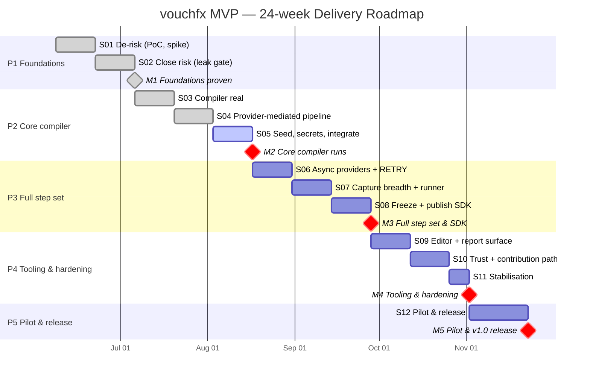

# vouchfx MVP — Delivery Roadmap (Gantt)

A sprint- and milestone-level view of the [delivery plan](README.md). Rendered natively by GitHub via
[Mermaid](https://docs.github.com/en/get-started/writing-on-github/working-with-advanced-formatting/creating-diagrams)
— no external tooling, and it stays in version control alongside the plan.

> Dates are **notional**, anchored to a Monday start (2026-06-08) purely to lay the bars out. Per
> MVP §7.2 the calendar sizes the effort; **milestones, not dates, are the measure of progress**.
> Sprint 11 is a 1-week stabilisation sprint; Sprint 12 is a 3-week pilot/release sprint.
>
> **Progress (2026-06-08):** Sprints **01–04 are merged to `main`** (PR #126/#127, #128, #131, #134) —
> delivered and integrated, CI green. Milestone **M1 — Foundations proven is reached** (closed after
> Sprint 02: the full Core-provider-closure leak gate and the reference provider). Phase 2 (Core
> compiler) is under way — the parser→AST→Roslyn pipeline, the provider-mediated compile pipeline, and
> three Core providers (`http.rest`, `db-assert.postgres`, `script.csharp`) with capture, substitution
> and Respawn isolation are in. **Sprint 05** (seed, env secrets, integrate) is next and closes
> Milestone **M2**.

## Milestone summary

| Milestone | Closes | ~Week | Gate |
|---|---|---|---|
| **M1** Foundations proven | S02 | 4 | Memory model gated over the full Core provider closure; health-gated stub topology; provider contract exercised; event-stream schema drafted. |
| **M2** Core compiler runs | S05 | 10 | Three providers run end-to-end with seed, env secrets, capture, reflective registry, terminal renderer. |
| **M3** Full step set & SDK | S08 | 16 | Six providers + RETRY; v1 schema/contract frozen; Provider SDK published & outside-validated; runner + polling timeline. |
| **M4** Tooling & hardening | S11 | 21 | VSCode + CLI feature-complete; reference scenario green; memory-leak CI gate; HTML/JUnit; CI templates; docs; signed release. |
| **M5** Pilot & v1.0 release | S12 | 24 | Cohort onboarded; criteria instrumented; v1.0 released; go/no-go assessment; community repo open. |

## Critical-path note

The spine is **B (compiler/runtime)**: the memory model (S01–S02) gates everything; the
provider-mediated pipeline (S04) gates breadth; the contract freeze (S08) gates the SDK and the editor.
Workstream **F** runs alongside B throughout, and **G (reporting)** is exercised continuously from S02
rather than retro-fitted — see the workstream-by-sprint heat map in the [plan index](README.md#6-workstream-activity-by-sprint).
